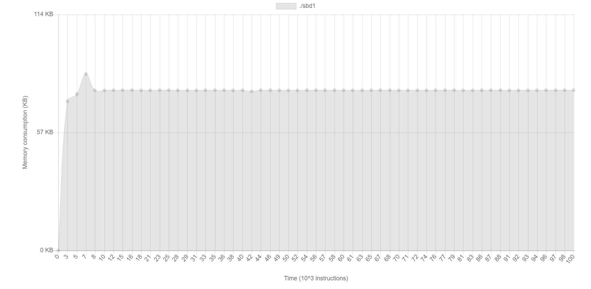
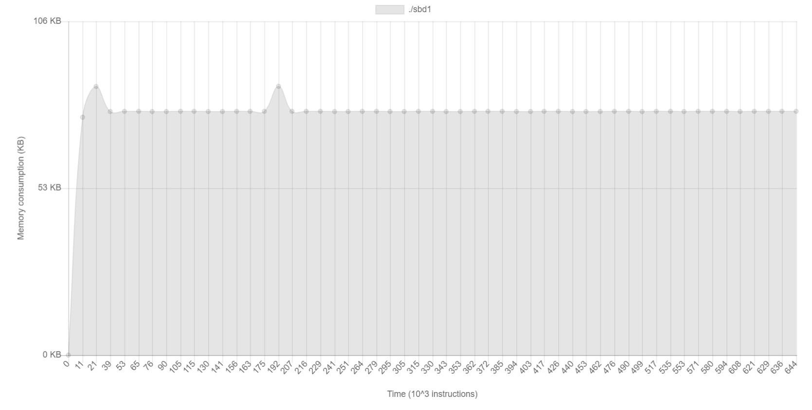
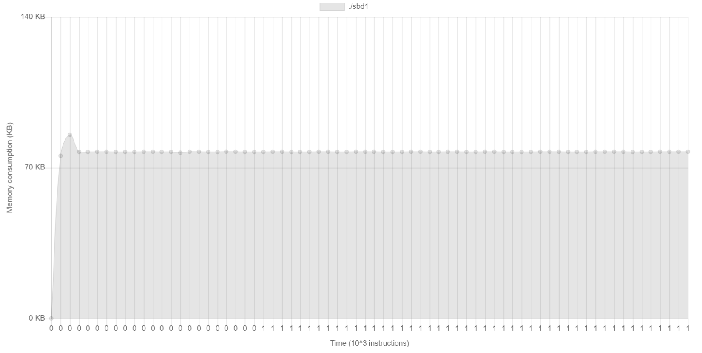

---
header-includes:
    - \usepackage{needspace}
    - \usepackage{float}
    - \floatplacement{figure}{H}
title: "Sprawozdanie Struktury Baz Danych Projekt 1"
author: "Sebastian Kwaśniak"
date: "`r Sys.Date()`"
geometry: margin=2cm
output:
    pdf_document:
        keep_tex: yes
        extra_dependencies: ["float"]
---

```{r include = FALSE}
knitr::opts_chunk$set(fig.pos = "!H", out.extra = "")
```

\renewcommand{\figurename}{Rys.}

# Wprowadzenie
Zaimplementowany przeze mnie algorytm to sortowanie przez scalanie w schemacie 2+1.
Wylosowane przeze mnie typy rekordów to:

>  29. File records: Right circular cylinders - the radius of the base and the
>  height of the cylinder. Sorting by volume.

Implementacja w języku C++. Przyjąłem, że jeden rekord jest podzielony na dwie liczby, rozmiar rekordu
to 8 bajtów (4 bajty dla podstawy, 4 bajty dla wysokości). Rozmiar strony ustaliłem na 32, a potem na 320.

# Sortowanie przez scalanie

Sortowanie przez scalanie jest prostym typem sortowania podzielonym na dwa etapy:
`distribute` oraz `merge`. Dystrybucja polega na rozłożeniu głównej taśmy na dwie pomocnicze, według schematu:

1. Weź liczbę
2. Sprawdź czy poprzednia była większa
3. Jak tak, wrzuć ją do aktualnie wybranej taśmy; jak nie, zmień wybraną taśmę i wrzuć do niej

Scalanie polega na schemacie:

1. Weź pierwsze rekordy z taśm pomocniczych
2. Wybierz mniejszy z dwóch rekordów
3. Wpisz go do głównej taśmy
4. Iteruj taśmę z której był wybrany rekord
5. Powtarzaj 2-4 aż do skończenia się jednej z taśm
6. Jeśli coś zostało w jakiejś taśmie, dopisz to na koniec głównej taśmy

Algorytm pozwala na posortowanie danych o rozmiarze większym niż rozmiar pamięci operacyjnej. Zużywamy:

\begin{align}
S_{\text{dysk}} &= NR \\
S_{\text{ram}} &= B
\end{align}

N - ilość rekordów; R - rozmiar rekordów w bajtach; B - rozmiar strony

Czas algorytmu prezentowany jest w operacjach dyskowych, na wykładzie
zostały pokazane następujące złożoności:

\begin{align}
T_{\text{pes}} = \frac{4N\lceil \log_2(N)\rceil}{b}
T_{\text{avg}} = \frac{4N\lceil \log_2(N)-1\rceil}{b}
\end{align}

gdzie $b = \frac{B}{R}$.

# Specyfikacja formatu pliku

Plik ma prosty format 8 bajtowych rekordów.
Cztery pierwsze bajty to podstawa walca, cztery następne bajty to wysokość walca.
Bajty te reprezentują ASCII cyfr zapisanych, aby uprościć analizę i odczyt.
Robi to ograniczenie liczb od 1 do 9999, lecz nie jest problemem zamiana długości rekordu
i rozszerzeniu ilości bajtów do zapisania tych liczb.

## Zapis

Zapis do pliku odbywa się w prosty sposób, dodając zera na początku liczby aby później
łatwiej było ją przekształcić w programie.

## Odczyt

Odczyt działa na zasadzie wzięcia pierwszych 4 bajtów, zamiany ich do liczby,
wczytaniu następnych 4 bajtów i również zamiany do liczby.

# Sposób prezentacji wyników

W programie mamy następujące komendy:

```
* * * * * * * * * * * * * * * * * * * * * * * * * * * * *
* Commands:
* help - shows this help
* dump - dump mainTape file, by volume
* random <N> - generate tape with random N records
* file - read tape from file (default name: input.txt)
* manual - generate tape from user input
* * * * * * * * * * * * * * * * * * * * * *
```

Mamy trzy główne sposoby na wprowadzenie danych:

- random: generuje N losowych rekordów
- file: zczytuje plik input.txt do wprowadzenia rekordów
- manual: wczytuje input od użytkownika z klawiatury

Mamy także funkcje pomocniczą `dump` która wypisuje wszystkie
rekordy z głównej taśmy w postaci objętości (wokół której w zadaniu było sortowanie).

Przykładowy plik input.txt (5 rekordów):

```
0005000500040004000300030002000200010001
```

Plik załadowany, po czym wprowadzona komenda `dump`:

```
> file
> dump
3.14159
25.1327
84.823
201.062
392.699
```

# Eksperyment

## Implementacja

## Wyniki

Wzór zastosowany do obliczenia operacji dyskowych i faz:

\begin{align}
T &= \frac{4N\lceil \log_2 r\rceil}{b} \\
\text{fazy} &= \lceil \log_2r \rceil
\end{align}

gdzie r - liczba serii

Dla wielkości strony 10 rekordów:

```{r, echo = FALSE}
data <- read.csv("b10.csv", header = TRUE)
data$Zapisy <- (data$IO/2)
data$Odczyty <- (data$IO/2)
data$"Teor.IO" <- (4*data$N*ceiling(log2(data$Serie)))/10
data$"Teor.Fazy" <- ceiling(log2(data$Serie))

library(knitr)
library(ggplot2)
kable(data, align = 'c')

ggplot(data, aes(x = N, y = IO)) +
  geom_point(color = "blue", size = 3) +
  geom_line(color = "red", linetype = "dashed") +
  labs(
    title = "Liczba operacji IO dla b=10",
    x = "N",
    y = "Operacje dyskowe"
  ) +
  scale_y_continuous(labels = scales::label_comma()) +
  theme_minimal()
```
Dla wielkości strony 100 rekordów:
```{r, echo = FALSE}
data <- read.csv("b100.csv", header = TRUE)
data$Zapisy <- (data$IO/2)
data$Odczyty <- (data$IO/2)
data$"Teor.IO" <- (4*data$N*ceiling(log2(data$Serie)))/10
data$"Teor.Fazy" <- ceiling(log2(data$Serie))

library(knitr)
library(ggplot2)
kable(data, align = 'c')

ggplot(data, aes(x = N, y = IO)) +
  geom_point(color = "blue", size = 3) +
  geom_line(color = "red", linetype = "dashed") +
  labs(
    title = "Liczba operacji IO dla b=100",
    x = "N",
    y = "Operacje dyskowe"
  ) +
  scale_y_continuous(labels = scales::label_comma()) +
  theme_minimal()
```

Jak widać, dla większej ilości strony, tym rzadziej ją wymieniamy,
przez co znacznie spadają ilości operacji dyskowych.
Gdy $N$ jest mniejsze niż rozmiar strony, to nie ma różnicy
spowodowanej rozmiarem bloków, bo do zapisu wszystkich danych
zostanie wyokrzystana tylko jedna strona na taśmę.

## Zużycie pamięci

Zużywana pamięć w programie jest stała, jak można zaobserwować
na poniższych danych z programu `valgrind --tool=massif`.

Dla 1000 rekordów:



Dla 5000 rekordów:



Dla 10000 rekordów:



Jak widać, ilość zużytej pamięci operacyjnej nie przekracza
80KB.

# Podsumowanie

Projekt pozwolił na zrozumienie jak wielkie pliki
są odczytywane z dysku, oraz jak zaimplementować
w prosty sposób własny sposób na zapis danych tak,
aby nie zużywać za dużo pamięci operacyjnej.
Wyniki eksperymentu są zgodne z oczekiwaniami
rozważanymi na poziomie teoretycznym jeśli chodzi o ilość operacji dyskowych,
oraz zużycie pamięci było stałe, więc zwiększanie liczby
rekordów nie zwiększa ilości zużywanej pamięci operacyjnej.
Liczba operacji IO zwiększa się proporcjonalnie do zwiększania
współczynnika blokowania, ale współczynnik nie ma wpływu na ilość faz algorytmu.